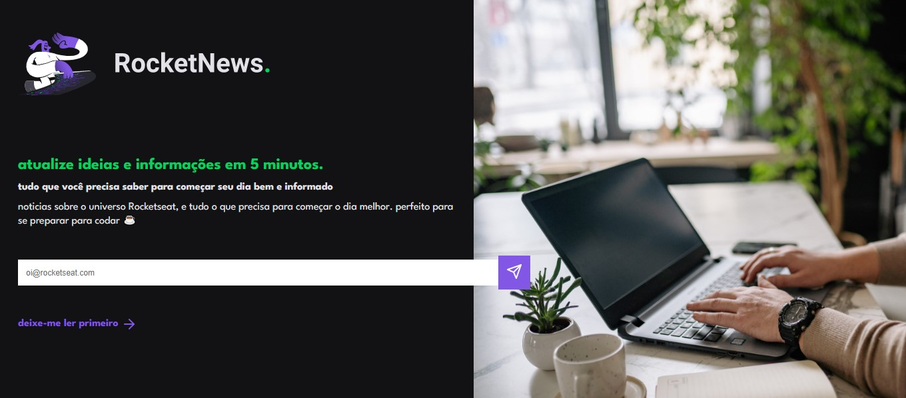

<h1 align="center">
   <p>RocketNews</p>
</h1>

<p align="center">
 <a href="#-funcionalidades">Funcionalidades</a> •
 <a href="#-layout">Layout</a> • 
 <a href="#-guia-de-estilo">Guia de estilo</a> • 
 <a href="#-tecnologias">Tecnologias</a> • 
 <a href="#autor">Autor</a>
</p>

<h4 align="center"> 
	🎉  RocketNews - Concluído  🎉
</h4>

##  Sobre
Aplicação desenvolvida para captação de leads ou newslettere, proposto como desafio da <a href="https://www.rocketseat.com.br/" target="_blank">Rocketseat.</a>

##  Carcterísticas

- Formulário para cadastro de e-mail do usuário.
- Alerta para o usuário quando o cadastro é realizado.
- Os e-maisl digitados são salvos no banco de dados.

##  Tecnologias

As seguintes ferramentas foram usadas na construção do projeto:

- [HTML](https://www.w3schools.com/html/)
- [PHP](https://www.w3schools.com/php/)
- [MySQL](https://www.w3schools.com/mysql/)
- [CSS](https://www.w3schools.com/css/)
- [Javascript](https://www.w3schools.com/js/js_intro.asp/)

##  Layout
O layout da aplicação está disponível no Figma:

<a href="https://www.figma.com/file/UnFYkPe50WOcN8OsocB2ns/DD-RocketNews-Copy?fuid=1100112420700070907">
  
</a>

<p style="display: flex; align-items: flex-start; justify-content: left;">
  
</p>

## 🎨 Guia de estilo

### Cores:
```css
:root {
  --body-bg-color: #121214;
  --text-color: #E1E1E6;
  --title-color: #04D361;
  --form-color: #A8A8A8;
  --bg-button-color: #8257e5;
}
```
### Tipo de Fonte:

- font-family: League Spartan', sans-serif;

- font-weight: 400, 500, 700

<a href="https://www.figma.com/file/EYimYoWWhNVjDZdc0zv1Vw/DD-Portfolio-Copy?fuid=1100112420700070907">
  
</a>

## 🦸 Autora

<a href="https://www.linkedin.com/in/tayanna-amorim-98161623b/">
 
 <br />
 <sub><b>Tayanna Amorim</b></sub></a> <a href="https://www.linkedin.com/in/tayanna-amorim-98161623b/" title="tayanna"></a>
 <br />

<br />

[](https://www.linkedin.com/in/tayanna-amorim-98161623b/) 
[](mailto:amorim.tayanna@gmail.com)
